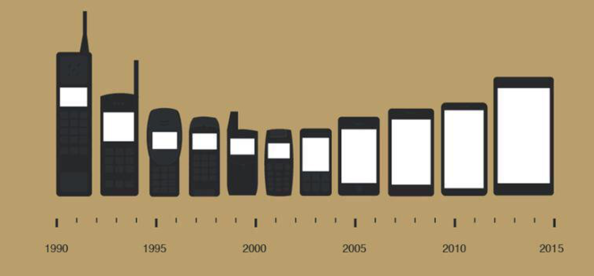
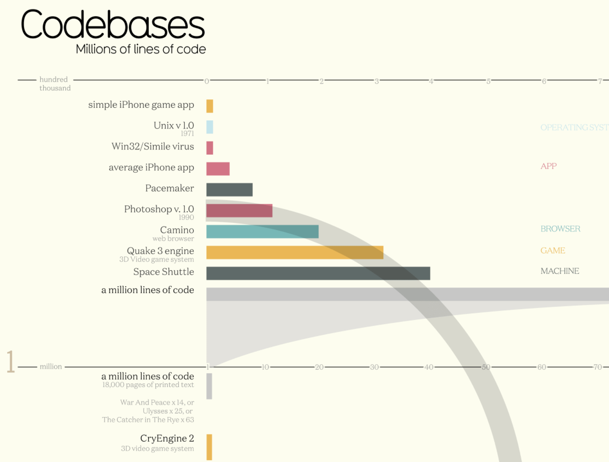
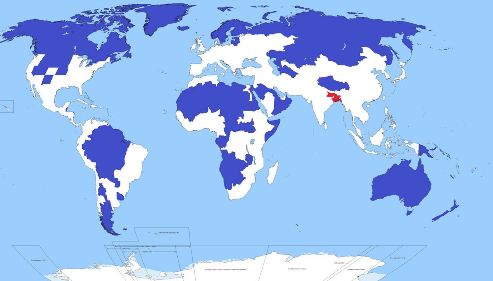
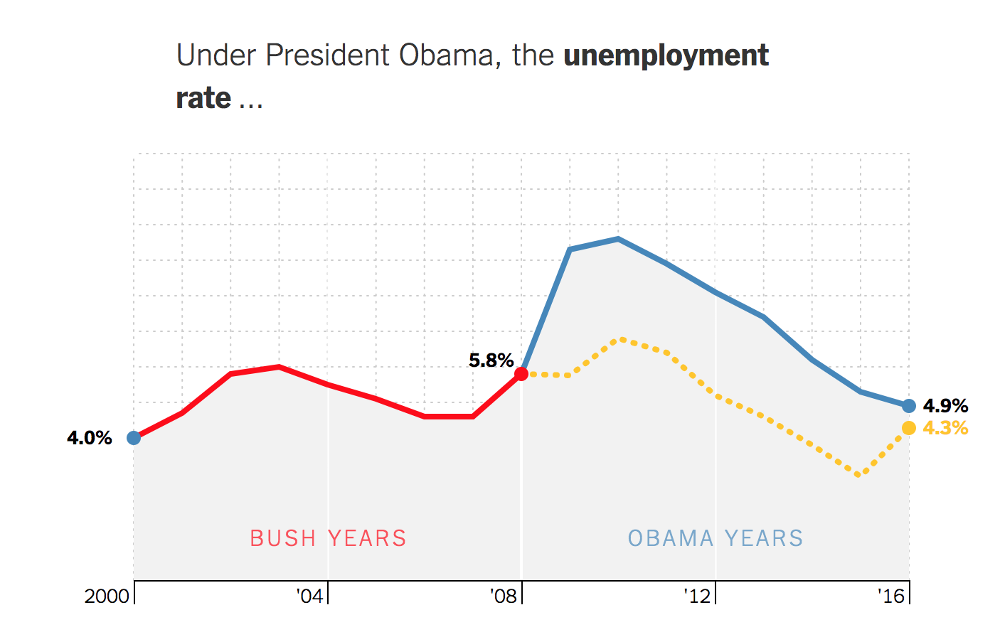

## :~$ whoami 

**Matthias Bannert**

- current occupation: data scientist / software developer @ETH Zurich
- occasional consultant 
- studied economics @UniKN, PhD @ETHZ: partly economics, mostly methodology + stats
- CTO of Swiss startup *fanpictor* from 2012-2014
- open source software projects: timeseriesdb, tstools, dropR, RAdwords

<div align="right">
</div>


## About this course

**Approach**
```
# listen - forget
# see - remember
# do - understand
```

**Goals**

- plan
- apply
- scale


## Overview

- Day 1: Organize
	- Introduction
	- Data Generating Processes
	- Types of Data
	- Manage and Archive
- Day 2: Process and Communicate
	- Visualization
	- Methodology

## Background Poll

<!-- ```{r,echo=FALSE}
library(grid)
library(shiny)
source("bullet.R")

fluidPage(sidebarLayout(sidebarPanel(
  numericInput("members", "Number of participants", 14),
  numericInput("prog", "Programming", 14),  
  numericInput("data", "Work With Data", 14),
  numericInput("rstats", "R Statistical Langauge", 14)
  ),
  mainPanel(
    renderPlot({
      techavg <- mean(c(input$prof,
                        input$data,
                        input$stats) / input$members)*100
  df1 <- data.frame(units = c("Prog(%)","data(%)","R(%)"),
                    low = c(25,25,25),
                    mean = c(50,50,50),
                    high = c(100,100,100),
                    target = c(techavg,techavg,techavg),
                    value = c(100*(input$prog/input$members),
                              100*(input$data/input$members),
                              100*(input$rstats/input$members)
                              )
                    )

  g <- gridBulletGraphH(df1,bcol = c("#999999","#CCCCCC","#E1E1E1"),
                   vcol = "#333333",font = 20)

  g + title(paste("Usage of Technologies Among Participants", sep=" "))

})  


    )
  ))

```
 -->

## Inspiration: Illustrate



## Inspiration: Relation



## Inspiration: Choropleth




## Inspiration: Draw R



[You Draw It! (NY Times)](https://www.nytimes.com/interactive/2017/01/15/us/politics/you-draw-obama-legacy.html?mcubz=0)

## Inspiration: Process Data

- download automatically
- read spreadsheet
- process 
- visualize

## Inspiration: Dynamic Reporting / Presentations

- create report
- dynamic figures & tables
- html, pdf, docx 


## Data Analytics Toolbox


<p style="font-size: 10px;">Quelle: all Logos taken from their respective companies' website.</p>

## Getting Started

```
"Premature optimization is the root of all evil."

```
<div align="right">Donald Knuth</div>

## But ...


## The R Language for Statistical Computing

- First appeared in 1993 
- designed by Ihaka and Gentleman
- Last Stable Release: 3.4.1

**Why R?**

- interpreted language
- interfaces to many compiled languages
- easy to learn
- open source, license cost free
- backed by Microsoft
- one-of-a-kind ecosystem, wide range of packages


## The R Ecosystem

- R Interpreter
- [CRAN Repository /w 10K+ packages](https://cran.r-project.org/)
- [CRAN Task Views](https://cran.r-project.org/web/views/)
- Community: [stackoverflow](https://stackoverflow.com/questions/tagged/r), Mailinglist, ...
- R Studio IDE / R Studio Server


## The R Studio IDE

- Switch to LTR Layout
- Console vs. Scripting window 
- comments
- short cut cmd+enter: run selection
- short cut ctrl+1, ctrl+2: switch windows
- short cut ctrl+L: clear console screen
- short cut command+D: multiple cursors @instances
- file explorer
- plot window
- .Rproj


## Basic R Objects

- vector
- matrix
- data.frame
- list

## Brackets and braces 

- **[row,col]**: Index
- **{}**: function or loop body
- **()**: function parameters

## Basic functions I

- ls()
- rm()
- c()
- matrix()
- data.frame()
- list()

**getting help**: ?function name


## Basic functions II

- head()
- tail()
- str()
- function()
- lapply()
- data()

**getting help**: ?function name


## Before you start ...  


## Good habits: Snakes ... 

- i_am_a_snake

<div align="right">
</div>


## and camels

- jeSuisUnCamel

<div align="right">
</div>


## Task I: Working on a built-in dataset

1. How many observations does the dataset mtcars have?
2. What's the miles-per-gallon average, median?
3. Which is the most ecological car? 
4. Which is the most ecological car by cylinders?
5. How is mpg distributed?
6. Why does solving analytics exercises through programming make sense?


## Summary I 

- scripting language is good start
- understanding a language helps to remember syntax
- many tasks can be solved w/o database, larger stack
- programming makes tasks scalable and reproducible


# How About Real Data ?

## Data Generating Processes: Simulation

**Why?**

- Form Expectations (Proposals / Grants)
- Detectability
- Analyzing complex systems 

study: http://ieeexplore.ieee.org/document/1622367/?reload=true


## Data Generating Processes: Logging

- sources: Webservers, IoT devices
- event based files
- not aggregated, large amounts of data

**solutions**:

- specific tools: awstats
- SaaS products
- programming

<div align="right">
<br />
<p style="font-size: 10px;">source tagesanzeiger.ch</p>
</div>


## Data Generating Processes: tracking

- user specific logging
- data similar to log data
- e-commerce tracking 
- often received through APIs in software as-a-service (Saas) products
    - Google Analytics
    - Google Adwords
    - Adsense

<div align="right">
<br />
<p style="font-size: 10px;">source: http://gantalcala.org/</p>
</div>


## Data Generating Processes: surveys

- input: online forms, smartphone apps, interviews, paper 
- result in cross sectional or panel data

<div align="right">
<br />
<p style="font-size: 10px;">source: pinterest</p>
</div>


## Data Generating Processes: download, (web) scraping

- web scraping
- scraping spreadsheets, html tables
- image processing
- prices from car vendor
- text mining


<div align="right">
<br />
<p style="font-size: 10px;">source: youtube, spaceballs</p>
</div>

## A Word on APIs

- REST popular on the web
- SOAP a bit more old fashioned, but used in B2B often
- APIs are an easy choices when receiving third party data
    - can be automatically processes
    - conflict with security policies


## Task II - Discussion: Security

Discuss in smaller groups: 

- Does using scripts to access the web conflict with your department's policies? 
- What would be a good option to receive 3rd party data?
- How could 3rd party data be merged with internal data?
- Where do you stand on cloud computing? 


## Types of datasets: time series

```{r}
ts2 <- ts(rnorm(20),
          start = c(1995,1),
          frequency = 4)
ts2
```

examples: monthly revenues over time, stocks, aggregated log files


## Types of datasets: cross sectional data

```{r}
head(mtcars)
```

- multiple variables
- one period


## Types of datasets: panel data

- multiple variables
- longitudinal data 
- e.g. German Socio-Economic Panel (GSOEP)


## Nested data structures

```{r}
l <- list()
l$element1 <- 2
l$element2 <- head(mtcars,4)
l
```

examples: meta information, sector classification (hierarchical), GDP components, translations, attributes, properties


## Task III: Dataset types

Represent each of the following dataset types using R: 

- time series
- cross section
- panel
- a nested structure.

Please suggest an in-memory representation and a file based representation. 


## A Short Note On Data Types in R

- character
- numeric
- factor (be warned of stringsAsFactor = T)
- ... 


## Data Management

**storage**

- file based
- database
    - relational
    - non-relational
    - hybrid solutions

**granularity**

- micro data / on-the-fly computation (e.g. OLAP cubes)
- aggregated data 


