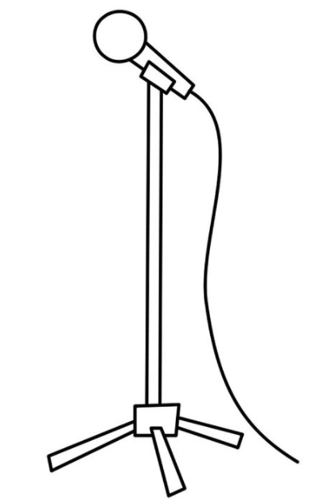

## Overview

- The Spotify Case (What DA is good for...)
- DGPs, Types of Data - Representing Data
- Analytical Strategy
- Visualization (Dygraphs, Highcharts, Shiny)
- Interfaces
- Methodology
- Deployment / Integration (Azure Example)
- Live after the seminar... 

## Good Morning Links

- [Google's 400M bet](https://www.bloomberg.com/news/articles/2017-10-05/google-s-new-phone-shows-how-a-400-million-bet-is-starting-to-pay-off)
- https://www.timescale.com/
- [Image Processing](https://github.com/kafka399/carCount/)
- [NZZ Artikel: Oft entscheiden Menschen sehr schlecht](https://www.nzz.ch/wirtschaft/oft-entscheiden-menschen-sehr-schlecht-ld.1325428)
- [Revolution Analytics Blog](http://blog.revolutionanalytics.com/)

## How a Data Driven Company Uses Data - The Spotify Case


## How a Data Driven Company Uses Data - The Spotify Case

- 'Discover Weekly' (consumption based playlist)
- B2B service for producers
- activity related music
- compose Music (currently duet functionality, but ...)

## Earl Conf..


## Task II - How About You?

What could a data driven business model for you look like ?

# DGPs and Resulting Types of Datasets

## Data Generating Processes: Logging

- sources: Webservers, IoT devices
- event based files
- not aggregated, large amounts of data

**solutions**:

- specific tools: awstats
- SaaS products
- programming

<div align="right">
<br />
<p style="font-size: 10px;">source tagesanzeiger.ch</p>
</div>

## Data Generating Processes: tracking

- user specific logging
- data similar to log data
- e-commerce tracking 
- often received through APIs in software as-a-service (Saas) products
    - Google Analytics
    - Google Adwords
    - Adsense

<div align="right">
<br />
<p style="font-size: 10px;">source: http://gantalcala.org/</p>
</div>


## Data Generating Processes: surveys

- input: online forms, smartphone apps, interviews, paper 
- result in cross sectional or panel data

<div align="right">
<br />
<p style="font-size: 10px;">source: pinterest</p>
</div>


## Data Generating Processes: download, (web) scraping

- web scraping
- scraping spreadsheets, html tables
- image processing
- prices from car vendor
- text mining


## Types of datasets: time series

```{r}
ts2 <- ts(rnorm(20),
          start = c(1995,1),
          frequency = 4)
ts2
```

examples: monthly revenues over time, stocks, aggregated log files


## Types of datasets: cross sectional data

```{r}
head(mtcars)
```

- multiple variables
- one period


## Types of datasets: panel data

- multiple variables
- longitudinal data 
- e.g. German Socio-Economic Panel (GSOEP)


## Nested data structures

```{r}
l <- list()
l$element1 <- 2
l$element2 <- head(mtcars,4)
l
```

examples: meta information, sector classification (hierarchical), GDP components, translations, attributes, properties, [Geo spatial data](https://github.com/mbannert/maps/blob/master/ch_bfs_regions.geojson)

## Data Management: Representing Data

- in memory
    - vector
    - matrix
    - data.frame
    - list
- on hard disk 
    - .RData
    - .xlsx
    - .csv
    - .json
    - .
- databases (interface & query language)

## A Few Words On SQL 

- ODBC as general interface
- RPostgreSQL (needs native drivers / client)
- RMySQL (needs native drivers / client)
- RSQLite 
- ... 

=> send queries (see local example) to DB


## A short note on SPSS

```{r, eval = FALSE}
library(foreign)
(sav <- system.file("files",
                    "electric.sav",
                    package = "foreign"))
dat <- read.spss(file=sav) 
str(dat)   # list structure with attributes

dat <- read.spss(file=sav, to.data.frame=TRUE) 
str(dat)   # now a data.frame
```

# Finally some Statistics !

## Analytical Strategy

- Validate data, read-in process
   - e.g., `head(), tail(), str(), View()`
   - data types correct?
   - custom patterns
- Descriptive Statistics
- Visualization / Distributions
- Inferential Statistics / Models
- Scaling / Deployment


## Some Useful Functions

```{r,eval=F}
mean()
sd()
summary()
quantile()
hist()
plot(density())
cor()
image()
```

## Why more ?


# Visualization

## Examples

- highcharts examples
- dygraphs example
- kmeans shiny app

Life after the seminar pt.I:

- https://python-graph-gallery.com/
- http://www.r-graph-gallery.com/
- https://d3js.org/
- https://plot.ly/products/dash/
- https://plot.ly/

- [Pie Charts](https://twitter.com/marinho_thas/status/921501296548630528)
- Edward Tufte

## Basic Hypothesis Testing: t.test

1. Is mpg significantly different in 4 or 6 cylinder cars?
2. Is displacement significantly different in automatic and manual transmission cars?

=> But what if there's more than two groups? 

## An Introduction to Linear Regression: univariate case

```{r}
fit1 <- lm(mpg ~ wt, data = mtcars)
summary(fit1)
```

## An Introduction to Linear Regression: multivariate case

```{r}
fit2 <- lm(mpg ~ ., data = mtcars)
summary(fit2)
```

## The Utopia Example

- DGP is simulated, we know parameters / true model
- What if we leave out variables


## Running an Example on Azure

- Insurance
- Used car market

## Visualization in R

- base plot
- ggplot2 'Grammar of Graphics'
- JS libraries (e.g. dygraphs)
- interactive GUIs (shiny framework)

## Time Series Analysis: Seasonal Adjustment

- Trend component
- Seasonal component
- noise
- State of the art: X13-Arima-SEATS (US Census Bureau)


## Misc

- local example: wizRd app
- deployment: fabric


## Writing a Custom Function

- function name (left of the arrow)
- function parameters (inside ())
- function body (inside {})

```{r, eval=FALSE}
useless_f <- function(a,b){
  a+b
}
```

## Warm up - Task I : Bulk investigate the built-in datasets

1. use the *data()* function to display all available 
built-in datasets

2. store the result of a call to *data()* in an object

3. investigate the resulting object with the tools you learned yesterday

4. Write a custom function that provides a nice summary of a dataset, e.g., dimensions.

5. write multiple datasets to disk. write all files in folder called *data*. Use lapply to write multiple files.


